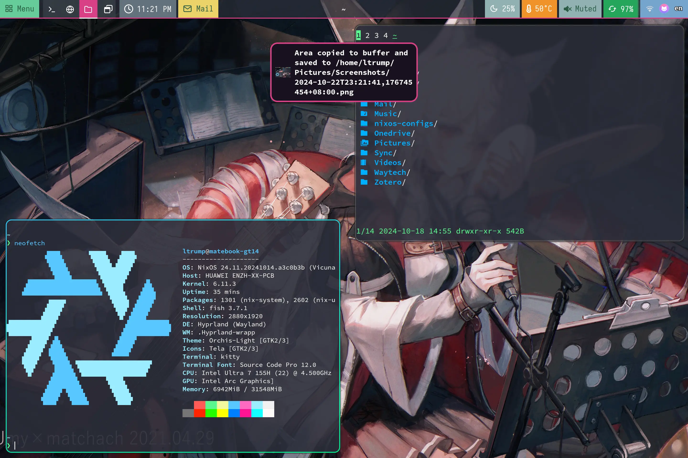
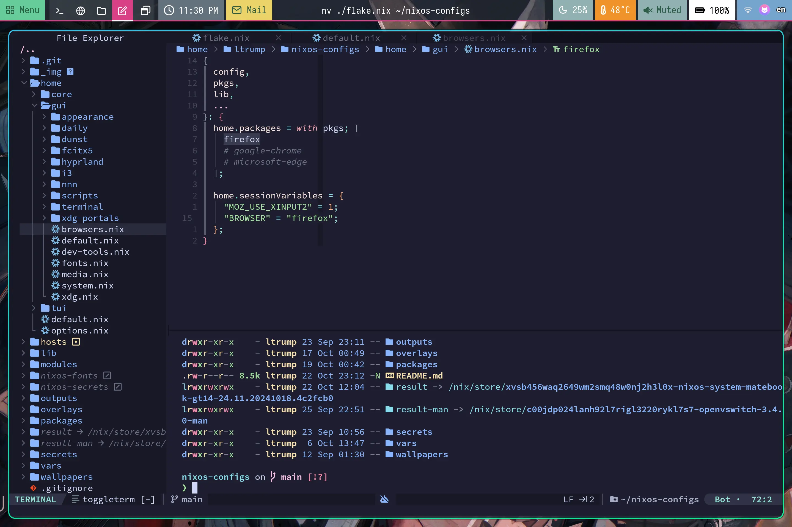
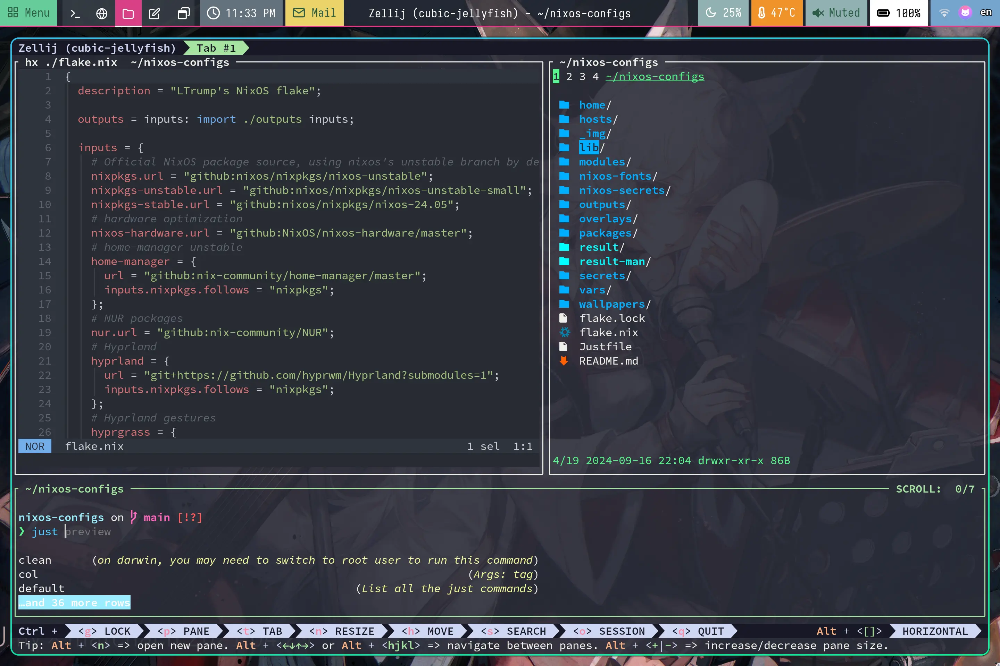

<h2 align="center">:snowflake: LTrump's Nix Config :snowflake:</h2>

  

> This configuration and READMEs in this repo borrows heavily from [ryan4yin/nix-config](https://github.com/ryan4yin/nix-config) and his 
> [cookbook](https://github.com/ryan4yin/nixos-and-flakes-book). Many thanks to his spirit of sharing!

This repository is home to the nix code that builds my systems:
Currently, this repository contains the nix code that builds:

1. NixOS Desktops: NixOS with home-manager, hyprland, agenix, etc.
2. NixOS Servers: K3s Host, KubeVirt, Home NUC, etc.

See [./hosts](./hosts) for details of each host.

## Why NixOS & Flakes?

Nix allows for easy-to-manage, collaborative, reproducible deployments. This means that once
something is setup and configured once, it works (almost) forever. If someone else shares their
configuration, anyone else can just use it (if you really understand what you're copying/refering
now).

As for Flakes, refer to
[Introduction to Flakes - NixOS & Nix Flakes Book](https://nixos-and-flakes.thiscute.world/nixos-with-flakes/introduction-to-flakes)

## Components

|                             | NixOS(Wayland)                                                 |
| --------------------------- | :------------------------------------------------------------- |
| **Window Manager**          | [Hyprland][Hyprland]                                           |
| **Terminal Emulator**       | [Zellij][Zellij] + [Kitty][Kitty]                              |
| **Bar**                     | [Waybar][Waybar]                                               |
| **Application Launcher**    | [rofi-wayland][rofi-wayland]                                   |
| **Notification Daemon**     | [Dunst][Dunst]                                                 |
| **Locker**                  | [swaylock-effect][swaylock-effect]                             |
| **network management tool** | [NetworkManager][NetworkManager]                               |
| **Input method framework**  | [Fcitx5][Fcitx5]                                               |
| **System resource monitor** | [Btop][Btop]                                                   |
| **File Manager**            | [nnn][nnn] + [thunar][thunar]                                  |
| **Shell**                   | [FishShell][fish] + [Starship][Starship]                       |
| **Music Player**            | [LX Music][lx-music-desktop]                                   |
| **Media Player**            | [mpv][mpv], [wiliwili][wiliwili]                               |
| **Text Editor**             | [Helix][Helix] + [Neovim][Neovim] ([ayamir/nvimdots][nvimdots])|
| **Fonts**                   | [Nerd fonts][Nerd fonts]                                       |
| **Image Viewer**            | [vimiv][vimiv], [imv][imv]                                     |
| **Screenshot Software**     | [grimblast][grimblast] + [Snipaste][Snipaste]                  |
| **Screen Recording**        | [OBS][OBS]                                                     |
| **Filesystem**              | [Btrfs][Btrfs] subvolumes, clean '/' every boot for impermance |

## Hyprland + Neovim + Helix

## Neovim

See [./home/tui/editors/neovim/](./home/tui/editors/neovim/) for details.

## Helix

See [./home/core/editors.nix](./home/core/editors.nix) for details.

## Secrets Management

See [./secrets](./secrets) for details.

## References

[Hyprland]: https://github.com/hyprwm/Hyprland
[Zellij]: https://github.com/zellij-org/zellij
[Kitty]: https://github.com/kovidgoyal/kitty
[Waybar]: https://github.com/Alexays/Waybar
[rofi-wayland]: https://github.com/lbonn/rofi
[Dunst]: https://github.com/dunst-project/dunst
[swaylock-effect]: https://github.com/mortie/swaylock-effects
[NetworkManager]: https://wiki.gnome.org/Projects/NetworkManager
[Fcitx5]: https://github.com/fcitx/fcitx5
[nnn]: https://github.com/jarun/nnn
[thunar]: https://gitlab.xfce.org/xfce/thunar
[fish]: https://github.com/fish-shell/fish-shell
[Starship]: https://github.com/starship/starship
[lx-music-desktop]: https://github.com/lyswhut/lx-music-desktop
[mpv]: https://github.com/mpv-player/mpv
[wiliwili]: https://github.com/xfangfang/wiliwili
[Helix]: https://github.com/helix-editor/helix
[Neovim]: https://github.com/neovim/neovim
[nvimdots]: https://github.com/ayamir/nvimdots/
[Nerd fonts]: https://github.com/ryanoasis/nerd-fonts
[vimiv]: https://github.com/karlch/vimiv
[imv]: https://sr.ht/~exec64/imv/
[grimblast]: https://github.com/hyprwm/contrib/tree/main/grimblast
[OBS]: https://obsproject.com
[Btrfs]: https://btrfs.readthedocs.io
[Btop]: https://github.com/aristocratos/btop
[Snipaste]: https://www.snipaste.com/
